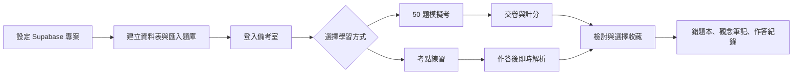
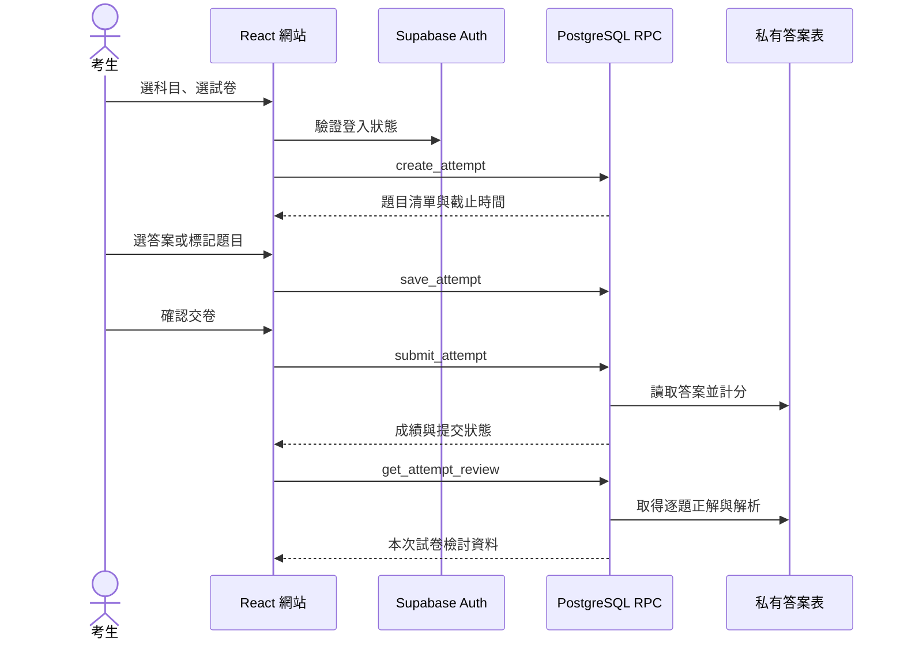

# 系統架構與目前狀態

> 說明 iPAS AI 備考室的使用流程、主要模組、資料信任邊界與交付狀態。核心原則是個人資料留在使用者自己的 Supabase 專案，答案與解析只透過授權流程揭露。架構依據是本專案程式碼與 Supabase migrations；更新日期：2026-09-30。

| 項目 | 狀態 |
|---|---|
| 產品範圍 | 桌面瀏覽器；L21、L23 中級考試 |
| 前端 | React、TypeScript、Vite |
| 帳號與資料 | Supabase Auth、PostgreSQL、Row Level Security |
| 題庫 | 400 題；每科 100 題歷屆、50 題仿題、50 題學習指引研究題 |
| 本機驗收 | 模擬考、交卷檢討、主題練習、歷史、收藏及個人資料隔離已驗收 |
| 公開部署 | 尚未設定主機或公開網址 |

## 目錄

1. [使用者流程](#使用者流程)
2. [架構與模組](#架構與模組)
3. [典型作答流程](#典型作答流程)
4. [安全與信任邊界](#安全與信任邊界)
5. [目前狀態與限制](#目前狀態與限制)
6. [主要依據](#主要依據)

## 使用者流程

使用者各自下載專案、建立自己的 Supabase 專案並匯入題庫。登入後可以在總覽查看弱點、挑選考點或開始模擬考。模擬考完成後查看分數和逐題解析，再自行選擇收藏錯題或觀念。登入同一份部署的其他電腦會讀取相同的個人進度。

## 架構與模組

| 模組 | 責任 | 主要位置 |
|---|---|---|
| 路由與登入 | 路由保護、Auth 狀態、註冊和重設密碼 | `src/App.tsx`、`src/auth/` |
| 學習總覽與考點目錄 | 章節瀏覽、最近模考、已作答弱點摘要 | `src/pages/DashboardPage.tsx`、`src/pages/TopicCatalogPage.tsx` |
| 模擬考與練習 | 建立作答、保存答案、時間倒數、交卷和檢討 | `src/pages/ExamPage.tsx`、`src/pages/PracticePage.tsx` |
| 個人收藏與歷史 | 錯題本、觀念筆記、模考紀錄 | `src/pages/LibraryPages.tsx` |
| 個人資料管理 | 匯出作答與收藏、清除目前帳號資料、引導刪除 Auth 帳號 | `src/pages/AccountDataPage.tsx`、`src/lib/account-data-service.ts` |
| Supabase 存取 | 題目查詢、試卷建立、作答與檢討 RPC | `src/lib/attempts.ts`、`supabase/migrations/` |
| 題庫來源 | 題目、正解、解析、來源與章節資料 | `content/questions/`、`scripts/` |

## 典型作答流程

建立模考時，前端依科目及所選試卷從公開題目池抽取 50 題，呼叫資料庫 `create_attempt` RPC。資料庫記錄登入者、題目清單及 90 分鐘期限。作答期間，`save_attempt` 儲存答案及標記；交卷時 `submit_attempt` 由資料庫讀取私有答案表計分、決定及格與否並鎖定結果。提交後，`get_attempt_review` 回傳該份試卷的正解及解析。主題練習則透過 `check_practice_answer` 逐題取得回饋。

## 安全與信任邊界

題目、選項及來源可由已登入使用者讀取；`question_answers` 不授予瀏覽器角色直接讀取。答案及解析由受控 RPC 在練習作答或模考提交後回傳。`exam_attempts`、`saved_questions` 與 `saved_concepts` 透過 RLS 限制為資料擁有者。Supabase secret key 只在本機題庫匯入指令使用，不供前端使用；`.env.local` 由 `.gitignore` 排除。

每位下載者應使用自己的 Supabase 專案與帳號，避免不同安裝者共用個人資料庫。部署前端時只設定 Supabase URL 與 publishable key。

## 目前狀態與限制

- 本機桌面網站流程已驗收：帳號登入、50 題模考、90 分鐘計時、保存答案、交卷計分、解析、考點練習、題目與觀念收藏、歷史紀錄、跨帳號資料隔離。
- Supabase 已載入 28 個考點、400 題及 400 筆私有答案；四份歷屆試卷各有 50 題。題庫檢查未發現通用官方解析、PDF 頁眉頁尾污染或待人工補圖題目。
- 弱點列表只計入實際作答的題目，不會把未作答視為答錯。
- 尚無公開網站部署。工作區已有本機 commit，但尚未設定 Git 遠端。跨電腦使用需要先指定 GitHub／Gitea 遠端、選擇靜態網站主機，再將公開網址加入 Supabase Auth。
- 個人資料管理頁和清除資料 RPC 已加入程式；使用者已套用 `202609300004_account_data_management.sql`。匿名 RPC 呼叫已驗證會遭拒，但尚未以登入帳號執行清除驗收。
- 手機版不在目前需求範圍。

當前待辦和驗收細節見[專案狀態與交接](PROJECT_STATUS.md)。

## 主要依據

- [Supabase 結構與題庫匯入說明](SUPABASE_SETUP.md)
- [網站產品規格](../.scratch/ipas-ai-prep-site/spec.md)
- [資料表與 RLS 規則](../supabase/migrations/202609290001_initial_schema.sql)
- [計分與受控答案存取 RPC](../supabase/migrations/202609290002_exam_integrity.sql)
- [媒體複核題目篩選](../supabase/migrations/202609290003_media_review_gate.sql)
